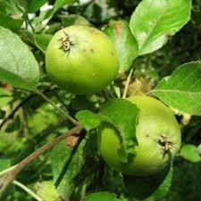
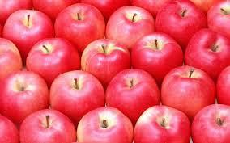
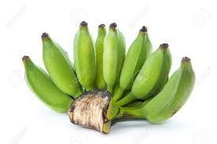
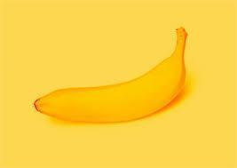
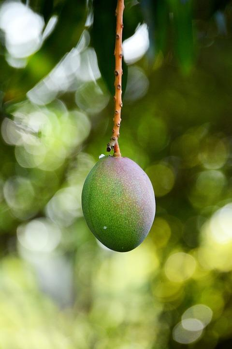

# RawRipe Dataset

[](https://creativecommons.org/licenses/by/4.0/)
[](https://github.com/your-repo/RawRipe)
[](https://github.com/your-repo/RawRipe)
[](https://github.com/your-repo/RawRipe)
[](https://github.com/your-repo/RawRipe)
[](https://github.com/your-repo/RawRipe/issues)
[](https://github.com/your-repo/RawRipe/pulls)
[](https://github.com/your-repo/RawRipe/graphs/contributors)
[](https://github.com/your-repo/RawRipe/commits)
[](https://doi.org/10.5281/zenodo.xxxxx)

A comprehensive dataset of fruit images in both raw and ripe states, designed for fruit maturity recognition tasks. The dataset includes images of 10 different fruit types, enabling various classification approaches from agricultural, market, and automation perspectives.

- **Project page**: `https://ieeexplore.ieee.org/document/9589215`
- **Original paper**: `https://ieeexplore.ieee.org/document/9589215`
- **Dataset repository**: `https://ieeexplore.ieee.org/document/9589215`

## TL;DR

- **Task**: Classification
- **Modality**: RGB
- **Platform**: Ground
- **Real/Synthetic**: Real
- **Images**: 1,630 labeled images
- **Classes**: 10 fruit types × 2 maturity states = 20 categories
  - **Apples**: raw (105), ripe (108)
  - **Bananas**: raw (84), ripe (115)
  - **Coconuts**: raw (72), ripe (78)
  - **Guavas**: raw (61), ripe (76)
  - **Litchis**: raw (50), ripe (74)
  - **Mangoes**: raw (97), ripe (62)
  - **Oranges**: raw (65), ripe (72)
  - **Papayas**: raw (69), ripe (102)
  - **Pomegranates**: raw (78), ripe (76)
  - **Strawberries**: raw (86), ripe (100)
- **Resolution**: Variable (original images)
- **Annotations**: COCO JSON (image-level via full-image boxes)
- **Total annotations**: 1,630 (one per image for classification)
- **License**: CC BY 4.0 (see LICENSE)
- **Citation**: See below

## Table of Contents
- [Download](#download)
- [Dataset Structure](#dataset-structure)
- [Sample Images](#sample-images)
- [Annotation Schema](#annotation-schema)
- [Stats and Splits](#stats-and-splits)
- [Quick Start](#quick-start)
- [Applications](#applications)
- [Evaluation and Baselines](#evaluation-and-baselines)
- [Datasheet (Data Card)](#datasheet-data-card)
- [Known Issues and Caveats](#known-issues-and-caveats)
- [License](#license)
- [Citation](#citation)
- [Changelog](#changelog)
- [Contact](#contact)

## Download

- **Original dataset**: Available through IEEE Xplore (see paper link)
- **This repository**: Hosts structure and conversion scripts only; place the downloaded folders under this directory.
- **Local license file**: See `LICENSE` (CC BY 4.0).

## Dataset Structure
```
RawRipe/
├── apples/                      # Apple fruit category
│   ├── raw/                     # Raw apple subcategory
│   │   ├── csv/                 # CSV per image
│   │   ├── json/                # JSON per image
│   │   ├── images/              # JPG images
│   │   ├── labelmap.json
│   │   └── sets/                # train.txt / test.txt (plus all.txt, train_val.txt)
│   ├── ripe/                    # Ripe apple subcategory
│   │   ├── csv/
│   │   ├── json/
│   │   ├── images/
│   │   ├── labelmap.json
│   │   └── sets/
│   └── labelmap.json            # Main category labelmap (optional)
├── bananas/                      # Banana fruit category
│   ├── raw/
│   ├── ripe/
│   └── labelmap.json
├── coconuts/                     # Coconut fruit category
├── guavas/                       # Guava fruit category
├── litchis/                      # Litchi fruit category
├── mangoes/                      # Mango fruit category
├── oranges/                      # Orange fruit category
├── papayas/                      # Papaya fruit category
├── pomegranates/                 # Pomegranate fruit category
├── strawberries/                 # Strawberry fruit category
├── annotations/                  # COCO JSON output (generated)
│   ├── apples_raw_instances_train.json
│   ├── apples_raw_instances_test.json
│   ├── apples_ripe_instances_train.json
│   └── ... (more COCO files)
├── scripts/
│   ├── convert_to_coco.py       # conversion utility
│   └── standardize.py           # standardization script
├── data/
│   └── original/                 # Original data directories (preserved for backup)
│       ├── geufruits5_train/
│       └── geufruits5_test/
├── docs/                         # Documentation
│   └── Fruit_Maturity_Recognition_from_Agricultural_Market_and_Automation_Perspectives.pdf
├── LICENSE
├── requirements.txt
└── README.md
```
- Splits: `{fruit_category}/{state}/sets/train.txt`, `{fruit_category}/{state}/sets/test.txt` (and also `all.txt`, `train_val.txt`) list image basenames (no extension). Note: Original dataset only provides train/test splits; validation set is empty.
- Note: This is a classification dataset. Each image has a full-image bounding box annotation for compatibility with detection frameworks.
- Fruit categories: apples, bananas, coconuts, guavas, litchis, mangoes, oranges, papayas, pomegranates, strawberries (10 total)
- Maturity states: raw, ripe (2 states per fruit)

## Sample Images

Below are example images from this dataset. Paths are relative to this README location.

<table>
  <tr>
    <th>Category</th>
    <th>Sample</th>
  </tr>
  <tr>
    <td><strong>Apple Raw</strong></td>
    <td>
      
      <div align="center"><code>apples/raw/images/Apple_Raw_test_27.jpg</code></div>
    </td>
  </tr>
  <tr>
    <td><strong>Apple Ripe</strong></td>
    <td>
      
      <div align="center"><code>apples/ripe/images/Apple_Ripe_train_100.jpg</code></div>
    </td>
  </tr>
  <tr>
    <td><strong>Banana Raw</strong></td>
    <td>
      
      <div align="center"><code>bananas/raw/images/Banana_Raw_train_60.jpg</code></div>
    </td>
  </tr>
  <tr>
    <td><strong>Banana Ripe</strong></td>
    <td>
      
      <div align="center"><code>bananas/ripe/images/Banana_Ripe_train_100.jpg</code></div>
    </td>
  </tr>
  <tr>
    <td><strong>Mango Raw</strong></td>
    <td>
      
      <div align="center"><code>mangoes/raw/images/Mango_Raw_train_85.jpg</code></div>
    </td>
  </tr>
  <tr>
    <td><strong>Mango Ripe</strong></td>
    <td>
      
      <div align="center"><code>mangoes/ripe/images/Mango_Ripe_train_100.jpg</code></div>
    </td>
  </tr>
</table>

## Annotation Schema

- **CSV per-image schema** (stored under `{fruit}/{state}/csv/` folder):
  - Format: `image_path, x_min, y_min, x_max, y_max, class_name`
  - Full-image bounding boxes: `(0, 0, width, height)` for classification compatibility
  
- **JSON per-image format** (stored under `{fruit}/{state}/json/` folder):
```json
{
  "info": {
    "description": "RawRipe {fruit} {state} classification dataset",
    "version": "1.0.0",
    "year": 2021,
    "contributor": "...",
    "url": "https://ieeexplore.ieee.org/document/9589215"
  },
  "images": [{
    "id": 1,
    "width": 256,
    "height": 256,
    "file_name": "image.jpg",
    "license": 0
  }],
  "annotations": [{
    "id": 1,
    "image_id": 1,
    "category_id": 1,
    "bbox": [0, 0, 256, 256],
    "area": 65536,
    "iscrowd": 0
  }],
  "categories": [{
    "id": 1,
    "name": "raw",
    "supercategory": "apples"
  }]
}
```
- **COCO-style** (generated):
```json
{
  "info": {"year": 2021, "version": "1.0.0", "description": "RawRipe {fruit} {state} {split}", "url": "https://ieeexplore.ieee.org/document/9589215"},
  "images": [{"id": 1, "file_name": "apples/raw/images/IMG_0001.jpg", "width": 256, "height": 256}],
  "categories": [{"id": 1, "name": "raw", "supercategory": "apples"}],
  "annotations": [{"id": 1, "image_id": 1, "category_id": 1, "bbox": [0, 0, 256, 256], "area": 65536, "iscrowd": 0}]
}
```

- **Label maps**: Each fruit/state folder includes a `labelmap.json` mapping category IDs to names.

## Stats and Splits

### Overall Statistics
- **Total Images**: 1,630
- **Training Images**: 1,216
- **Test Images**: 414
- **Fruit Types**: 10
- **Maturity States**: 2 (raw, ripe)
- **Total Subcategories**: 20 (10 fruits × 2 states)

### Per-Fruit Statistics

| Fruit | Raw (Train/Test) | Ripe (Train/Test) | Total |
|-------|------------------|-------------------|-------|
| Apples | 78/27 | 81/27 | 213 |
| Bananas | 63/21 | 86/29 | 199 |
| Coconuts | 54/18 | 58/20 | 150 |
| Guavas | 45/16 | 56/20 | 137 |
| Litchis | 37/13 | 55/19 | 124 |
| Mangoes | 72/25 | 46/16 | 159 |
| Oranges | 48/17 | 54/18 | 137 |
| Papayas | 51/18 | 77/25 | 171 |
| Pomegranates | 58/20 | 57/19 | 154 |
| Strawberries | 65/21 | 75/25 | 186 |

### Splits
- **Train/Test Ratio**: Approximately 75/25
- Splits are provided via `{fruit}/{state}/sets/train.txt` and `{fruit}/{state}/sets/test.txt`
- Note: Original dataset only provides train/test splits; no validation set is provided. The `val.txt` files are empty.

## Quick Start

### Using COCO API

```python
from pycocotools.coco import COCO
import json

# Load COCO annotations
coco = COCO('annotations/apples_raw_instances_train.json')

# Get all image IDs
img_ids = coco.getImgIds()
print(f"Total images: {len(img_ids)}")

# Get all category IDs
cat_ids = coco.getCatIds()
categories = [coco.loadCats([id])[0]['name'] for id in cat_ids]
print(f"Categories: {categories}")

# Load a specific image and its annotations
img_id = img_ids[0]
img_info = coco.loadImgs([img_id])[0]
ann_ids = coco.getAnnIds(imgIds=[img_id])
anns = coco.loadAnns(ann_ids)

print(f"Image: {img_info['file_name']}")
print(f"Size: {img_info['width']}x{img_info['height']}")
print(f"Annotations: {len(anns)}")
```

### Converting to COCO format

If you need to regenerate COCO annotations from CSV files:

```bash
python scripts/convert_to_coco.py --root . --out annotations --splits train test
```

### Standardizing Dataset

To reorganize the dataset to the standardized structure:

```bash
python scripts/standardize.py
```

### Dependencies

**Required**:
- `Pillow>=9.5` (for image processing)

**Optional**:
- `pycocotools>=2.0.7` (for COCO API)

Install with:
```bash
pip install -r requirements.txt
```

## Applications

This dataset can be used to solve three types of classification problems:

1. **Raw vs Ripe for a specific fruit** (agricultural perspective)
   - Binary classification: Determine if a specific fruit (e.g., apple) is raw or ripe
   - Example: Train on `apples/raw` vs `apples/ripe`

2. **Raw vs Ripe for any fruit** (market perspective)
   - Binary classification: Determine if any fruit is raw or ripe, regardless of fruit type
   - Example: Combine all `raw` subcategories vs all `ripe` subcategories

3. **Multi-class/label classification** (automation perspective)
   - Multi-class classification: Classify both fruit type and maturity state
   - Example: 20 classes (10 fruits × 2 states)

## Evaluation and Baselines

- **Primary metric**: 
  - Classification: Accuracy, Precision, Recall, F1-score (per class and macro-averaged)
- **Baseline results**: See original paper for baseline results (all three classification perspectives: agricultural, market, and automation)

## Datasheet (Data Card)

### Motivation

This dataset was created to support research in fruit maturity recognition from agricultural, market, and automation perspectives, which is crucial for automated fruit sorting, quality control in agricultural markets, and robotic harvesting applications.

### Composition

The dataset consists of:
- **Image types**: RGB images of fruits in raw and ripe states
- **Categories**: 10 fruit types (apples, bananas, coconuts, guavas, litchis, mangoes, oranges, papayas, pomegranates, strawberries) with 2 maturity states each (raw, ripe)
- **Annotation format**: Image-level classification annotations (via full-image bounding boxes)

### Collection Process

- **Source**: Images collected from search engines and agricultural sources
- **Annotation tool**: Manual annotation of fruit type and maturity state
- **Validation**: Images verified for correct fruit type and maturity state

### Preprocessing

- Images standardized to consistent format
- Full-image bounding boxes added for detection framework compatibility
- Dataset reorganized into standardized structure with consistent naming conventions

### Distribution

- Dataset is distributed under CC BY 4.0 license
- Original data available through IEEE Xplore
- This repository provides standardized structure and conversion scripts

### Maintenance

- Dataset structure has been standardized according to the dataset structure specification
- COCO format annotations are generated from CSV files using the provided conversion script

## Known Issues and Caveats

1. **No Validation Set**: The original dataset only provides train/test splits. Users may need to split the training set further to create a validation set.
2. **Image Size Variation**: Images have variable resolutions (not standardized to a fixed size).
3. **Limited Samples**: Some fruit/state combinations have relatively few samples (e.g., Litchis raw: 50 images).
4. **Classification Task**: This is a classification dataset. Full-image bounding boxes are provided for compatibility with detection frameworks, but there are no instance-level annotations.
5. **Original Structure**: The original dataset had three different organizational structures (Model 1, Model 2, Model 3). This standardized version uses Model 1 structure as the primary source.

## License

This dataset is licensed under the Creative Commons Attribution 4.0 International License (CC BY 4.0).

Check the original dataset terms and cite appropriately.

See `LICENSE` file for full license text.

## Citation

If you use this dataset in your research, please cite:

```bibtex
@INPROCEEDINGS{9589215,
  author={Rao Jerripothula, Koteswar and Kumar Shukla, Sarvesh and Jain, Samyak and Singh, Shudhanshu},
  booktitle={IECON 2021 – 47th Annual Conference of the IEEE Industrial Electronics Society},
  title={Fruit Maturity Recognition from Agricultural, Market and Automation Perspectives},
  year={2021},
  pages={1-6},
  doi={10.1109/IECON48115.2021.9589215}
}
```

**Paper Link:** https://ieeexplore.ieee.org/document/9589215

## Changelog

- **V1.0.0** (2025): Initial standardized structure and COCO conversion utility

## Contact

- **Maintainers**: Open to contributions via issue tracker
- **Original authors**: Rao Jerripothula, Koteswar; Kumar Shukla, Sarvesh; Jain, Samyak; Singh, Shudhanshu
- **Source**: `https://ieeexplore.ieee.org/document/9589215`
